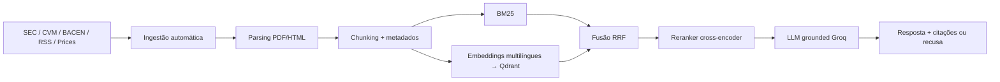

# Apresentação — Legacy Capital AI Retrieval System

## 1. O problema

Analistas de equities respondem perguntas que exigem reunir fragmentos espalhados por centenas de documentos, períodos e fontes. O desafio não é ler um documento — é **descobrir quais documentos existem e conectá-los**.

## 2. A solução

Plataforma de pesquisa estilo NotebookLM, com três diferenças fundamentais:
- **Base conectada**: ingestão automática de SEC, CVM, BACEN, notícias e preços — zero upload manual
- **Dados heterogêneos**: texto (filings, releases) e estruturados (IF.data, preços) no mesmo retrieval
- **Rastreabilidade total**: toda resposta cita documento e trecho; sem evidência → "Não encontrei essa informação na base."

## 3. Arquitetura



**Princípio central**: o LLM nunca responde com conhecimento próprio — apenas sintetiza as evidências recuperadas.

## 4. Decisões técnicas (e por quê)

| Decisão | Escolha | Justificativa |
|---------|---------|---------------|
| Busca híbrida | BM25 + vetorial, fusão RRF | Termos financeiros exatos (capex, RPO) + semântica; RRF dispensa calibração de scores |
| Embeddings | multilingual-e5-small | Base bilíngue (filings EN + CVM PT); o eval provou que modelo EN-only falhava em PT |
| Reranker | mmarco-mMiniLMv2 (multilíngue) | Top-50 candidatos → top-10; logits calibram a recusa |
| Recusa | threshold no logit do reranker (-2.0) | Calibrado empiricamente: relevantes > 0, irrelevantes < -4 |
| LLM | Groq / Llama 3.3 70B (free tier) | Qualidade de síntese sem custo; trocável via .env (OpenAI/Ollama) |
| Chunks | ~1800 chars, overlap 200 | Preserva contexto de tabelas financeiras; 822 docs → 63k chunks |

## 5. Eval-driven development (a parte mais importante)

Construímos o harness **antes** de otimizar retrieval: 14 perguntas verificadas manualmente contra documentos reais (single-doc, multi-doc, multi-período, estruturada, não-respondível).

O ciclo funcionou na prática:

1. **Baseline** (modelos EN-only, top-k 20): Recall@10 0.57, MRR 0.52, respostas 67%
2. **Diagnóstico via eval**: perguntas em português refusavam (reranker EN-only); fatos afogados em 10-Ks de 500KB (top-k pequeno); 1 rótulo gold errado (corrigido)
3. **Melhorias**: embeddings + reranker multilíngues, top-k 50, threshold recalibrado
4. **Resultado**: _(métricas finais na tabela do README)_

> Sem o eval, cada uma dessas mudanças seria "achismo". Com ele, é medição.

## 6. Aprendizados sobre RAG

- **Retrieval quebra silenciosamente**: o LLM produz texto plausível mesmo com contexto errado — só o eval detecta
- **A dificuldade real está na ingestão**: o press release de um 8-K está nos *exhibits* (nomes arbitrários), não no documento principal; guidance em faixa contamina extração de métricas; encoding latin-1 na CVM
- **Dados de referência mentem**: o código inicial tinha o CIK da CoreWeave apontando para outra empresa e o código CVM do Itaú apontando para o Banco do Brasil — validar contra a fonte oficial é obrigatório
- **Bilinguismo importa**: modelos de embedding/rerank EN-only degradam silenciosamente em bases mistas

## 7. Resolução dos cases (sem lógica hardcoded)

### Case A — Capex hyperscalers vs NVIDIA
Perguntas à plataforma genérica, com citações: capex 2025 reportado por MSFT/AMZN/META/GOOGL, receita Data Center da NVIDIA (US$ 75,2 bi no 1T FY27, +92% YoY) e comentário de demanda Blackwell.

### Case B — Bancos brasileiros
- **Promessa vs entrega**: guidance real do Bradesco (fev/2025: carteira 4-8%, margem R$37-41 bi) vs revisão (jul/2025: serviços e seguros revisados para cima)
- **Sentimento**: comparação trimestre a trimestre via retrieval multi-período
- **Estratégia vs market share**: IF.data real (data-base 2026-03) — Nubank 2,03%, Itaú 11,6%, Bradesco 10,0% do sistema (R$ 7,26 tri)

### Case C — Backtest RPO
- 43 eventos de 7 empresas, RPO extraído dos press releases reais
- Timing de divulgação via `acceptanceDateTime` oficial da SEC → retorno do 1º pregão
- **Achado**: aceleração positiva → 67% de pregões positivos (média +0,75%); desaceleração → 27% (média -0,19%). Correlação agregada fraca — amostra pequena, reportado honestamente

## 8. Escalabilidade

- Nova empresa = adicionar ticker na config (SEC/CVM) — nenhum código novo
- Nova fonte = um fetcher que retorna `Document` — o resto do pipeline é agnóstico
- Qdrant escala horizontalmente; embeddings em GPU (~370 chunks/s numa RTX 3050)
- Ponto de atenção: BM25 em memória → migrar para Tantivy/ES acima de ~100k chunks

## 9. Limitações

- RPO estruturado cobre 7/15 empresas (demais divulgam só em tabelas de 10-Q)
- Sem filtro temporal explícito no retrieval
- Earnings call transcripts sem fonte gratuita estável
- Amostra do backtest sem significância estatística

## 10. Demo ao vivo

```bash
docker compose up -d qdrant
python scripts/query.py "Qual é o market share do Nubank segundo o BACEN?"
python scripts/query.py "What did NVIDIA say about Blackwell demand?"
python -m legacy_retrieval.eval.run --k 10
python scripts/run_case_c.py
```
