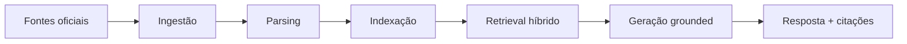

# Apresentação — Legacy Capital AI Retrieval System

## 1. Problema

Analistas de equities precisam responder perguntas complexas cruzando centenas de documentos ao longo de vários anos. O desafio não é ler um documento — é **encontrar os documentos certos**.

## 2. Solução

Plataforma de pesquisa estilo NotebookLM com:
- Ingestão automática de fontes oficiais (sem upload manual)
- Retrieval híbrido (BM25 + vetorial + reranking)
- Respostas grounded com citações
- Recusa explícita quando não há evidência

## 3. Arquitetura



**Princípio central:** Retrieval é o coração. LLM apenas sintetiza evidências.

## 4. Decisões técnicas

| Decisão | Escolha | Justificativa |
|---------|---------|---------------|
| Vector DB | Qdrant | Simples, performático, bom para MVP |
| BM25 | rank_bm25 | Sem dependência de Elasticsearch |
| Fusão | RRF (k=60) | Robusto para combinar rankings heterogêneos |
| Embeddings | MiniLM local + OpenAI opcional | Offline para dev, qualidade para prod |
| Eval-first | Harness antes de otimizar | Mede progresso objetivamente |

## 5. Aprendizados sobre RAG

1. **Retrieval > LLM** — Um GPT-4 com documentos errados produz respostas erradas
2. **Busca híbrida é essencial** — Capex, RPO, provisões são termos exatos (BM25) + contexto semântico (vetorial)
3. **Chunking importa** — Documentos financeiros longos precisam de overlap e metadados ricos
4. **Eval harness é obrigatório** — Sem métricas, não dá para saber se mudanças melhoram o sistema
5. **Dados estruturados ≠ RAG puro** — Market share do BACEN precisa de SQL + texto integrados

## 6. Resolução dos Cases

### Case A — NVIDIA / Capex
- Multi-empresa: MSFT, AMZN, META filings indexados
- Consolidação de capex via retrieval multi-documento
- Comentários NVIDIA sobre demanda de hyperscalers

### Case B — Bancos brasileiros
- Guidance vs entrega: Bradesco provisões Q1 → Q3
- Sentimento temporal: Itaú Q2 cauteloso → Q4 otimista
- Market share: BACEN SCR + estratégia declarada

### Case C — Backtest RPO
- Extração de RPO de filings (Salesforce, ServiceNow)
- Cálculo de YoY growth e acceleration
- Backtest engine: correlação acceleration × retorno pós-earnings

## 7. Resultados do Eval

Métricas implementadas:
- **Recall@k** — % documentos esperados recuperados
- **Precision@k** — % resultados relevantes no top-k
- **MRR** — posição do primeiro documento correto
- **Taxa de recusa** — perguntas não respondíveis corretamente recusadas

Gold dataset: 10 perguntas cobrindo documento único, multi-doc, multi-período e não respondível.

## 8. Vantagens da abordagem

- Arquitetura genérica (não hardcoded por case)
- Ingestão reproduzível e extensível por fonte
- Funciona offline com dados demo
- Eval harness automatizado
- Citações rastreáveis em toda resposta

## 9. Limitações

- Parsing de PDFs com tabelas complexas
- Scrapers de RI frágeis (mitigado com cache configurável)
- Embeddings locais menos precisos em português
- Backtest demo usa dados sintéticos

## 10. Escalabilidade

- Fetchers independentes por fonte → adicionar empresa = configurar ingestão
- Qdrant escala horizontalmente para milhões de chunks
- Pipeline stateless → API pode escalar com múltiplas instâncias
- Próximo passo: Celery para ingestão agendada

## 11. Demo ao vivo

```bash
python scripts/seed_demo_data.py
python scripts/index.py
python scripts/query.py "What is Microsoft capex guidance for 2025?"
python -m legacy_retrieval.eval.run --k 10
python scripts/validate_cases.py
```
